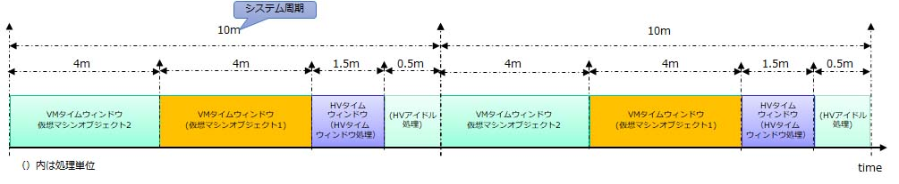
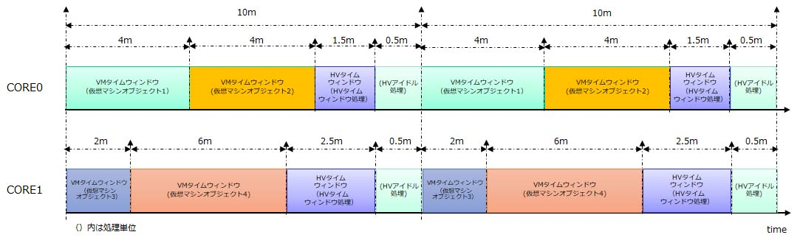
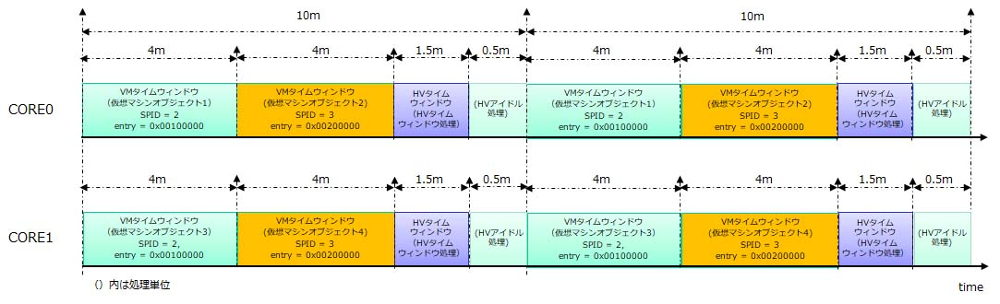
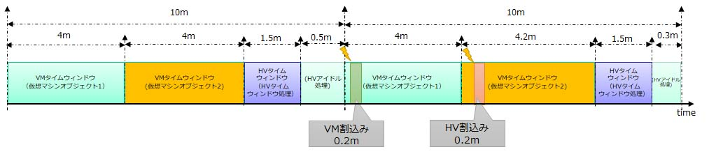
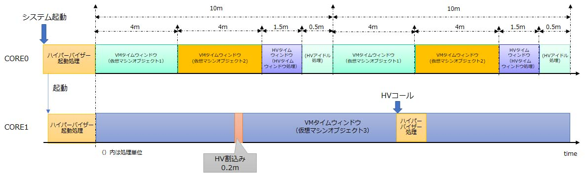
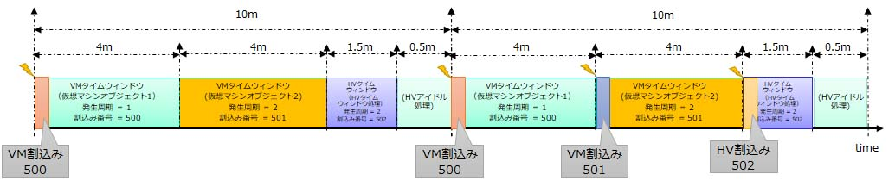

# SafeG-Auto 仕様書

# このドキュメントについて

SafeG-Auto の仕様について説明したものである．

# 仕様策定方針

- 実装が複雑化しない仕様とする
    - ハイパーバイザーはシステムの最高の安全度水準で開発する必要があるため，可能な限り規模を小さくして，シンプルな実装とする． 

# コンフィギュレーション

仮想マシンの定義やスケジューリング等の設定は，設計時のみに指定することが可能である（静的コンフィギュレーション）．

コンフィギュレーション方法は現状はC言語のヘッダーファイル（hv_cfg.h）及びソースコード（hv_cfg.c）にC言語で記述する．

将来的にはxmlやyamlでのコンフィギュレーション方法をサポートすることを想定している．

# 処理単位

ハイパーバイザーを用いたシステムでは，ユーザーの処理（関数）は，ゲスト処理とユーザーホスト処理に分類される．

ゲスト処理は，プロセッサのゲストモードで実行される処理であり，仮想マシン内で実行される．

ユーザーホスト処理はプロセッサのホストモードで実行される処理であり，ハイパーバイザーから呼び出される各種のハンドラやホストモードで動作する処理単位の本体として実行される．

ハイパーバイザーで扱う処理単位の一覧を以下に示す．

- ゲスト処理
  - 仮想マシン
- ユーザーホスト処理
  - HVタイムウィンドウ処理
  - HVアイドル処理
  - HV割込みハンドラ
  - HVサービル関数
  - HVフック関数
  - HVユーザー起動関数

## 仮想マシン

仮想マシンはゲストモードで実行される処理単位である．

仮想マシンはシステム上に複数作成することが可能であり，各仮想マシンオブジェクトはIDで識別する．なお，IDはGPIDとは独立である．

1つの仮想マシンオブジェクトは，RH850の1つのコアの各種コンテキストを持つ．

### コンフィギュレーション

仮想マシンオブジェクト毎に以下のパラメータを指定する．

	- コアID
	- リセットベクタ先頭アドレス
	- GPID
	- SPIDリスト
	- 初期SPID
	- メモリ情報
  		- アクセス可能なメモリの上位アドレス・下位アドレス・アクセス属性
  		- 個数は，HV管理としたMPUのエントリ数が上限となる
	- バインドする割込みの割込番号のリスト

### 初回実行

仮想マシンは実行が開始されると，リセットベクタから処理が開始される．それ以降は中断した箇所から処理を再開する．

仮想マシンオブジェクトの初回実行時のコンテキストの状態は次の通りである．

- 汎用レジスタ
  - 不定値
- PC
  - 初期化情報で指定されたリセットベクタ先頭アドレス
- EBASE
  - 初期化情報で指定されたリセットベクタ先頭アドレス
- SPID
  - 初期化情報で指定された初期SPID
- SPIDLIT
  - 初期化情報で指定されたSPIDリスト
- MPM
  - ホスト管理のエントリによる保護の有効(GMPE=1)
- その他のリセット時の値が指定されているシステムレジスタ
  - リセット時の値
- その他のリセット時の値が指定されていないシステムレジスタ
  - 不定値

### 使用可能なコプロセッサ

コプロセッサは，FPUのみ使用することが可能である．

### MPU

MPUはホスト管理エントリで保護される．

ホスト管理エントリは，初期化情報のメモリ情報によりハイパーバイザーが仮想マシンオブジェクト実行時に設定される．

ゲスト管理のMPUエントリはサポートしない．

ホスト管理のMPUエントリで発生したMPU例外は，ホストモードで受け付ける．

### マルチコア環境

1つの仮想マシンオブジェクトは指定したコアと同じコアのタイムウィンドウにのみ割り付けることが可能である．言い換えると，1つの仮想マシンオブジェクトは，特定のコアでのみ実行される．

## HVタイムウィンドウ処理

HVタイムウィンドウ処理は，ホストモードでHVタイムウィンドウ内で実行される処理である．

RTOSにおけるタスクと同様に，独立したコンテキストを持ち，スタックは他のユーザーホスト処理と独立したものを使用する．

HVタイムウィンドウが開始されると実行され，HVタイムウィンドウの時間が経過すると中断され，次のHVタイムウィンドウで再開される．

### 初回実行

HVタイムウィンドウ処理の初回実行時は，ハイパーバイザーと同一バイナリにある以下の名前の関数から実行が開始される．

  void hv_twd(void)

HVタイムウィンドウ処理の初回実行時のコンテキストの状態は次の通りである．

- PSW : 以下のビット以外は全て0
  - EIMASK : 最低優先度
  - EBV    : 1(EBASE有効)
  - CU0    : 1(FPU有効)
- PLMR
  - 最低優先度  
- 汎用レジスタ
  - TP  : シンボル __tp
  - GP  : シンボル __gp
  - スタックポインタ : HVタイムウィンドウ処理のスタックの下限アドレス+4
- 割込みモード
  - 拡張割込みモード

PSWのEVB=0・FPUを無効や，割込みモードの変更をした場合の動作は保証しない．

### マルチコア環境

エントリとなる関数は同一であるが各コアでそれぞれの独立したコンテキストとして実行される．

実行タイミングは各コアで独立である．

### コンフィギュレーション

コア毎に以下のパラメータを指定する．

	- スタックサイズ

## HVアイドル処理

HVアイドル処理は，アイドル区間内でホストモードで実行される処理である．

RTOSにおけるタスクと同様に，独立したコンテキストを持つ．

スタックは，HV割込みハンドラ/HVサービス関数/HVフック関数と共有する．

アイドル区間が開始されると実行され，次のシステム周期が開始されると中断され，次のアイドル区間で再開される．

### 初回実行

HVアイドル処理の初回実行時は，ハイパーバイザーと同一バイナリの以下の名前の関数から実行が開始される．

  void hv_idle(void)

HVアイドル処理の初回実行時のコンテキストの状態は次の通りである．

- PSW : 以下のビット以外は全て0
  - EIMASK : 最低優先度
  - EBV    : 1(EBASE有効)
  - CU0    : 1(FPU有効)
- PLMR
  - 最低優先度  
- その他レジスタ
  - TP  : __tp に設定 
  - GP  : __gp に設定
  - スタックポインタ : HVスタックのアドレスに設定
- 割込みモード
  - 拡張割込みモード

PSWのEVB=0・FPUを無効や，割込みモードの変更をした場合の動作は保証しない．

### マルチコア環境

エントリとなる関数は同一であるが各コアでそれぞれの独立したコンテキストとして実行される．

実行タイミングは各コアで独立である．

## HV割込みハンドラ

HV割込みハンドラは，ホストにバインドした割り込みが発生した場合にホストモードで呼び出されるハンドラである．

スタックは，HVアイドル処理/HVサービス関数/HVフック関数と共有する．

HV割込みが発生するとハイパーバイザーを経由して登録されたHV割込みハンドラが呼び出される．

HV割込みハンドラは，割込み禁止状態で実行される．割込みを許可した場合は動作は保証しない．

### コンフィギュレーション

HV割込みハンドラ毎に以下のパラメータを指定する．

	- 割込み番号
	- 実行するコアID
	- 割込み優先度
	- 割込許可の初期状態
	- 割込みハンドラアドレス

設定可能な優先度は，0から13の範囲である．

## HVサービス関数

HVサービス関数は，hvtrapを契機にホストモードで呼び出されるハンドラである．

スタックは，HVタイウィンドウ処理/HVアイドル処理/HVフック関数と共有する．

hvtrapが呼び出されると，ハイパーバイザーを経由して登録されたHV割込みハンドラが呼び出される．

HVサービス関数は，割込み禁止状態で実行される．

### コンフィギュレーション

HVサービス関数毎に以下のパラメータを指定する．

	- HVサービス関数のアドレス

## HVフック関数

ハイパーバイザーの各種タイミングで呼び出される関数．

以下のフック関数が存在する．

- 起動時フック関数
  - HVの起動時に各種初期化が終了後，システム周期を開始する直前に呼び出される．
- システム周期フック関数
  - システム周期切替え時に呼び出される．
- タイムウィンドウ切替えフック関数
  - タイムウィンドウ切換え時に呼び出される．

HVフック関数は全ての割込みは禁止した状態で呼び出させる．HVフック関数で割込みを許可した場合の動作は保証しない．

## HVユーザー起動関数

システム起動時にスタートアップコードから，ハイパーバイザーの起動前に呼び出される関数．

HVユーザーメイン関数から，ハイパーバイザースタート関数を呼び出すことにより，ハイパーバイザーの動作が開始される．

# スケジューリング

## システム周期

時間保護を実現するため，スケジューリングはTDMAを用いる．

TDMAではシステム周期を指定し，システム周期内の時間を複数のタイムウィンドウに分割する．

タイムウィンドウ間には空白時間を入れることはできない．

ハイパーバイザーの初期化が終了した後，先頭のタイムウィンドウに割り付けられた処理を実行する．

先頭のタイムウィンドウの実行後，指定された時間経過したら次のタイムウィンドウに割り付けられた処理に切り替える．

全てのタイムウィンドウを実行したら，次のシステム周期の開始時刻までアイドル区間となる．

次のシステム周期の開始時刻になれば，再び先頭のタイムウィンドウに割り付けられた処理から実行を繰り返す．

システム周期とタイムウィンドウの長さはマイクロ秒で指定する．

システム周期を切り替えるハイパーバイザーの処理をシステム周期切換え処理と呼ぶ．

タイムウィンドウを切り替える処理やアイドル区間に切り替えるハイパーバイザーの処理をタイムウィンドウ切換え処理と呼ぶ．

 

### コンフィギュレーション

システム全体で次のパラメータを指定する．

	- システム周期

### マルチコア環境

全てのコアでシステム周期は同一である．

タイムウィンドウの割付けは，コア毎に独立であり，1つのタイムウィンドウを複数のコアに割り付けることは出来ない．

ハイパーバイザー起動時に各種初期化終了後，コア間で同期した後にシステム周期をスタートさせる．

実行時のシステム周期のコア間の同期は実施しない．

 

マルチコアで動作するアプリケーションを実行した場合は，コアIDとバインドする割込みの割込み番号のリストは同じコンフィギュレーション情報で仮想マシンオブジェクトをコア数分用意すればよい．

同一のタイミングで各コアに割り付けた仮想マシンオブジェクトを実行したい場合は，同一タイミングで実行されるタイムウィンドウを各コアに割付け，そのコアに割り付けた仮想マシンオブジェクトを割り付ければよい．

 

## タイムウィンドウ

各タイムウィンドウは任意の時間長（タイムウィンドウ長）と実行する処理を指定することが可能である．

タイムウィンドウは次の2種類がある．

- VMタイムウィンドウ
  - ソフトウェアはゲストモードで実行される．
  - 仮想マシンを1個割り付けることが可能である．
  - 同一の仮想マシンを同一コアの複数のタイムウィンドウに割り付けることが可能である．

- HVタイムウィンドウ
  - ソフトウェアはホストモードで実行される．HVとバイナリを共有するHVタイムウィンドウ処理が実行される．
  - HVタイムウィンドウは複数個定義することが可能である．
  - 定義された全てのHVタイムウィンドウにおいて，同一のHVタイムウィンドウ処理が実行される．

### コンフィギュレーション

タイムウィンドウ毎に次のパラメータを指定する．

	- 割付けコア
	- 実行順序
	- 実行時間
	- 割付けVMのVMID
	- タイムウィンドウトリガ割込の割込み番号(オプション)
	- タイムウィンドウトリガ割込の割込み周期(オプション)

割付けVMのVMIDには，HVタイムウィンドウの場合は0を指定する．

## アイドル区間とHVアイドル処理

システム周期の最後にはタイムウィンドウを割り付けない区間を設ける（アイドル区間）．
この区間ではホストモードでHVアイドル処理が実行される．

## 各処理単位が消費する時間

各処理単位は実行されると，次に割り当てられた時間（バジェット）を消費する．

| 処理単位                |  対象
| -------                 | -----------
| 仮想マシン              | 割り付けられたVMタイムウィンドウ
| HVタイムウィンドウ処理  | HVタイムウィンドウ
| HVアイドル処理          | アイドル区間
| HV割込みハンドラ        | アイドル区間
| HVサービス関数          | 呼び出した仮想マシンが実行されているVMタイムウィンドウ．ただし，VMタイムウィンドウの終了時刻を超過した場合はアイドル区間
| HVフック関数            | アイドル区間

## 処理優先度

各処理の処理優先度は次の通りである．

|  優先度  |  処理単位           
| -------- | ------------------- 
|  高      |  HVサービス関数/HV割込みハンドラ/HVフック関数/システム周期切換え処理/タイムウィンドウ切換え処理
|  低      |  仮想マシン/HVタイムウィンドウ処理/HVアイドル処理

# 割込み

割込みは，仮想マシンに割り付けたVM割込みと，ホストに割り付けたHV割込みの2種類に分類できる．

コンフィギュレーション時にVMに割り付ける割込みを指定する．指定しない割込みはHV割込みとなる．

VM割込みは，割り付けた仮想マシンのタイムウィンドウが実行されており，仮想マシンの状態が割込み受付状態であれば，仮想マシン内で受け付けられる．

ホストモードでは拡張割込みモードを有効にして動作する．

## マルチコア環境

マルチコア環境においては，INTC2の割込みは次の様にコアに割り付けられる．

- VM割込み
  - 割り付けたVMが実行されるコアに対して割込みを発生させる．
- HV割込み
  - HV割込み定義時に指定したコアに対して割込みを発生させる．

# マルチコア対応

## コアID

各コアを識別するためのIDをコアIDと呼ぶ．コアIDは0から始まり，CPU0のコアIDは0である．

## HVサポートコア

ハイパーバイザーを実行するコアを指定することが可能である．

ハイパーバイザーを実行するコアをHVサポートコアと呼ぶ．

HVサポートコア以外のコアにはハイパーバイザーとは異なるバイナリを配置して実行することを想定する．

HVサポートコア以外のコアでハイパーバイザーが起動した場合はスタートアップコードで無限ループとする．

## シングルVMコア

HVサポートコアは，シングルVMコアに指定することも可能である．

シングルVMコアとしたコアでは，システム周期をサポートせず，1個のタイムウィンドウのみ割り付けることが可能である．

常にこの1個のタイムウィンドウに割り付けた仮想マシンオブジェクトのみを実行する．

タイムウィンドウの長さは無視される．

HVタイムウィンドウ処理やアイドル処理は実行されず，タイムウィンドウ切換え処理やシステム周期切換え処理は実行されない．

## リーダコア

HVサポートコアのうちの1コアをリーダコアとする．

リーダコアは，電源投入後に起動して，他のHVサポートコアの起動や起動時の共有リソースの初期化等を行う．

### コンフィギュレーション

システム全体で次のパラメータを指定する．

	- HVサポートコア
	- シングルVMコア(HVサポートコアに含まれている必要がある)
	- リーダコア(HVサポートコアに含まれている必要がある)

# 起動シーケンス

起動シーケンスは次の通りである．

ハイパーバイザーは，ユーザーメイン関数から，StartHV()を呼び出すことにより起動する．
<- は他コアもリーダコアと同じ処理を行うことを示す．

| 場所 | リーダコア |  他コア
| ------- | ---------- | ------------------- 
|ターゲット依存のスタートアップ | 他のHVサポートコアの起動  |
|| 自コアのLRAMの初期化 | <-
|| CRAMの初期化              | CRAMの初期化待ち
|ユーザー起動関数 | ユーザー定義の初期化 | <-
|                   | StartHV()の呼び出し | <-
| StartHV()         | バリア同期1 | <-
|| ターゲット依存の初期化 | <-
|| バリア同期2 | <-
|| HVの初期化  | <-
|| TDMAスケジューリングの初期化 | <-
|| HVタイムウィンドウの初期化 | <-
|| HV割込みの初期化 | <-
|| VM間通信モジュールの初期化 | <-
|| バリア同期3 | <-
|| スレーブガードの初期化 | スレーブガードの初期化待ち
|| バリア同期4 | <-
|| システム周期・タイムウィンドウ用のタイマの初期化 | <-
|| バリア同期5 | <-
|| スタートアップフックの呼び出し | <-
|スタートアップフック | ユーザー定義の初期化 | <-
| StartHV()         | バリア同期6 | <-
|| システム周期用のタイマのスタート | <-
|| システム周期割込みの発生 | <-
|| 割込みの許可 | <-
|| TDMAスケジューリングの開始 | <-

# HVコール

HVコールは，仮想マシンからHVサービス関数を呼び出す機能である．

仮想マシンからhvtrapを呼び出すことにより実行される．

各HVサービス関数には機能コードが割り付けられており，hvtrapを呼び出す際に指定する．

HVコールのコーリングコンベンションは次の通りである．

- 機能コード
  - r9
- 引数
  - 第1引数 : r7
  - 第2引数 : r6
  - 第3引数 : r8
- 戻り値
  - 32bit r10
  - 64bit r10,r11
- スクラッチレジスタ
  - r4(tp), r5(gp), r7 - r19,  r30(ep), r31(lp)

HVコールによるHVサービス関数実行中は，HV割込みは禁止される．そのため，タイムウィンドウ切り換え直前に呼び出した場合は，タイムウィンドウ切り換えは遅延する．

HVコールによるHVサービス関数は，実行中のタイムウィンドウのバジェットを消費して実行される．

# ハイパーバイザ動作時のSPIDの扱い

各コアのハイパーバイザー動作時のSPIDはコンフィギュレーションで指定する．

各コアに同じ値を設定することや，異なる値を設定することも可能である．

指定された値は，ハイパーバイザー起動時に各コアで設定する．起動後は同じ値を保持する．

ハイパーバイザーでは起動時以外は，SPIDの設定は行わないため，ユーザーホスト処理でSPIDを変更した場合の動作の動作は保証しない．

## コンフィギュレーション

コア毎に次のパラメータを指定する．

	- ハイパーバイザー動作時のSPID
    
# 保護設定

スレーブガートとMPUを使用して次のように保護を行うことを基本とする．

設定は次の2種類を組み合わせで実現する．

 - ハイパーバイザーがコンフィギュレーション情報を元に設定する内容．
 - ハイパーバーサーユーザーが各種フックで設定する内容．

それぞれの項目の先頭の[]は次の意味である．

- Guard
    - スレーブガードによる保護
- MPU
    - MPUによる保護
- INTC1
    - INTC1のGPIDによる保護

## ハイパーバイザーによる設定

- RAM
    - [Guard]全てのRAMを全コアのHVと仮想マシンのSPIDからのみ読み書き可能に設定する．
        - IVCで使用するCRAMの領域は含まない
    - [MPU]仮想マシン毎のメモリのコンフィギュレーションにより、仮想マシン実行時にホスト管理のMPUを設定
- 周辺回路(INTC1以外のCPU周辺回路を含む)
    - [Guard]全ての周辺回路を全てのコアのHVのSPIDからのみ読み書き可能に設定．
- INTC2
    - [Guard]全てのコアのHVのSPIDからのみ読み書き可能に設定．
    - [Guard]仮想マシンにバインドした割込みのEEICは、全コアのHV及びその仮想マシンのSPIDからのみ読み書き可能に設定．
        - コンフィギュレーションにより決定
- INTC1
    - [Guard]他のコアのHVや仮想マシンからの読み書きを禁止する．
    - [INTC1]自コアからのEEICnとIMR0への読み書きは、対応するチャネルがバインドされたGPID、または、ホストモードからのアクセスのみ許可
      - INTC1の機能でありハイパーバイザーによる設定は不要

## ハイパーバイザーユーザーによる設定
- RAM
    - [Guard]DMA等のコア以外のマスタからアクセスする必要があれば設定．
- 周辺回路
    - [Guard]仮想マシンが使用する周辺回路はアクセス可能なようにスレーブガードを設定する．
- INTC2
    - 設定の必要はない
- INTC1
    - 設定の必要なし

# タイムウィンドウトリガ割込み

タイムウィンドウトリガ割込みは，VMタイムウィンドウ及びHVタイムウィンドウの開始時に割込みを発生させる機能である．

タイムウィンドウ毎に1個登録することが可能である．

VMタイムウィンドウではVM割込みとして，HVタイムウィンドウではHV割込みとして発生する．

各タイムウィンドウトリガ割込みはタイムウィンドウ登録時に次の属性で指定する．

- 割込み番号
  - タイムウィンドウトリガ割込みとして発生させる割込みの割込み番号．
  - 使用しないデバイスの割込みを使用することを想定. 
  - VMタイムウィンドウの場合は，割り付けたVMに割り付けた割込みのみ指定可能．
- 発生周期
  - タイムウィンドウトリガ割込みを発生させる周期
  - 1を指定すると毎システム周期発生させる
  - 2を指定すると，システム開始後，2周期目に発生し，これ以降2周期に1回発生させる．

同一VMが属する複数のタイムウィンドウには，同じ割込み番号を指定することも可能である．
その際，発生周期に関してはタイウィンドウ毎に管理される．

## コンフィギュレーション

タイムウィンドウのコンフィギュレーション情報として指定する．

# ユーザーホスト処理向けサービス

## ハイパーバイザーの起動
### void StartHV(void)
### 機能
	呼び出されたコアでハイパーバイザーの動作を開始する．
	ユーザーメイン関数からのみ呼び出し可能である．
	HVサポートコア以外から呼び出された場合はリターンする．

## HVタイムウィンドウの残り時間取得
### ER ercd = GetHVTWTimeLeft(uint32 *p_time) 
### パラメータ
	uint32 *	pTimeLeft	残り時間を入れるメモリ領域へのポインタ
### リターンパラメータ
	ER		ercd		正常終了(E_OK)またはエラーコード
	uint32	pTimeLeft	タイムウィンドウの残り時間
### エラーコード
	E_OK	正常終了
	E_CTX	コンテキストエラー
			HVタイムウィンドウ処理以外からの呼び出し
### 機能
	実行中のHVタイムウィンドウの残り時間をマイクロ秒で取得する．
	割込みを禁止して呼び出すことが可能である．
	HVタイムウィンドウ処理が呼び出した場合，呼び出し直後にタイムウィンドウ切り換えが発生すると，実際の残り時間と異なる値となる可能性があるため，ある程度のマージンを持って使用する必要がある．

# ゲスト処理向けサービス

## VMタイムウィンドウの残り時間取得

### ER ercd = GetVMTWTimeLeft(uint32 *pTimeLeft)

### パラメータ
	uint32 *	pTimeLeft	残り時間を入れるメモリ領域へのポインタ
### リターンパラメータ
	ER		ercd		正常終了(E_OK)またはエラーコード
	uint32	pTimeLeft	タイムウィンドウの残り時間
### エラーコード
	E_OK	正常終了
### 機能
	実行中のVMタイムウィンドウの残り時間をマイクロ秒で取得する．
	呼び出し直後にタイムウィンドウ切り換えが発生すると，実際の残り時間と異なる値となる可能性があるため，ある程度のマージンを持って使用する必要がある．
	割込みを禁止して呼び出すことが可能である．
	ライブラリ関数として仮想マシン内で実行される．

# VM間通信機能

VM間通信機能はHVコールを用いて呼び出す．

## 状態変数

1：n向けのキューイングなしの通信を実現．

オブジェクトはIDにより識別する．

書き込み可能な仮想マシンは指定した特定の1つのVMのみ．

読み込み可能な仮想マシンには制限はない．

ハイパーバイザーは制限なしに読み書き可能．

## コンフィギュレーション

オブジェクト毎に次のパラメータを指定する．

	- 状態変数オブジェクトのバッファサイズ（バイト指定）
	- 初期状態 : アクティブ/ディアクティブ
        - アクティブ/ディアクティブをサポートしないなら初期値を設定する
	- 書き込み可能な仮想マシン

状態変数オブジェクトのバッファサイズが大きくなると，状態変数関連のサービスの実行時間が長くなる．
サービス実行中はタイムウィンドウ切り換えが発生しないため，許容するタイムウィンドウのジッタによりシステムインテグレータが決定する．

## 状態変数オブジェクトへのデータ書き込み

### ER ercd = WriteStateVariable(uint SvarID, const void* Variable)

### パラメータ
	uint		SvarID 		対象状態変数のID
	const void*	Variable 	書込みデータの格納先の先頭番地
### リターンパラメータ
	ER		ercd		正常終了(E_OK)またはエラーコード
### エラーコード
	E_OK		正常終了
	E_ID		ID番号が不正
	E_MACV		Variableで示す領域が不正
	E_OACV		書き込み許可されていないVMからの呼び出し
### 機能
	SvarIDで示す状態変数オブジェクトのバッファに対して，Variableで示すアドレスから対象状態変数オブジェクトのサイズ分のデータを書き込む．
	Variableの示すアドレスから対象状態変数オブジェクトのサイズ分のメモリが，本APIを呼び出した仮想マシンから読み込み出来ない領域の場合は，エラーを返す．
	状態変数オブジェクトの状態がディアクティブの場合はアクティブになる．
	書き込みが許可されていない仮想マシンからの呼び出しであればエラーとなる．

## 状態変数オブジェクトからのデータ読み込み

### ER ercd = ReadStateVariable(uint SvarID, void *Variabale)

### パラメータ
	uint	SvarID		対象状態変数のID
	void*	Variable	読込みデータの格納先の先頭番地
### リターンパラメータ
	ER		ercd		正常終了(E_OK)またはエラーコード
### エラーコード
	E_OK		正常終了
	E_ID		ID番号が不正
	E_MACV		Variableで示す領域が不正
	E_OBJ		状態変数オブジェクトの状態がディアクティブ
### 機能
	SvarIDで示す状態変数オブジェクトのバッファから，Variableで示すアドレスに対して対象状態変数オブジェクトのサイズ分のデータを書き込む．
	Variableの示すアドレスから状態変数のサイズ分のメモリが，本APIを呼び出した仮想マシンから書き込み出来ない領域の場合は，エラーを返す．
	状態変数オブジェクトの状態がディアクティブの場合はエラーを返す．

## 状態変数オブジェクトの状態をディアクティブに変更

### ER ercd = DeactivateStateVariable(uint SvarID)

### パラメータ
	uint	SvarID		対象状態変数のID
### リターンパラメータ
	ER		ercd		正常終了(E_OK)またはエラーコード
### エラーコード
	E_OK		正常終了
	E_ID		ID番号が不正
	E_OACV		書き込み許可されていないVMからの呼び出し
### 機能
	SvarIDで示す状態変数オブジェクトの状態をディアクティブに変更する．
	書き込みが許可されていない仮想マシンから呼び出された場合はエラーとなる．

## メッセージキュー

1:1のキューイング通信をサポート．

メッセージは最大長が設定されていて，それ以下の任意のサイズで送信可能．

メッセージサイズは保存され，受信側はそのサイズ分受け取る．

オブジェクトはIDにより識別する．

書き込み可能なVMは1つのみ．

読み込み可能なVMは1つのみ．

バッファはメッセージを格納する毎に次のように使用されるために実際格納可能なサイズは小さくなる
4バイトの管理領域(サイズ情報)  + メッセージサイズを4バイトに丸めた値 

## コンフィギュレーション

オブジェクト毎に次のパラメータを指定する．

	- 最大メッセージサイズ
		 - 許容するタイムウィンドウのジッタによりシステムインテグレータが決定する．
	- バッファサイズ（バイト）
	- 初期状態 : アクティブまたはディアクティブ
	- 書き込み可能な仮想マシン
	- 読み込み可能な仮想マシン

## メッセーキューオブジェクトへのメッセージ書込み

### ER ercd = WriteMessageQueue(uint MsgqID, const void *Message, uint MsgSize)
### パラメータ
	uint 		MsgqID  	対象メッセージキューのID
	const void*	Message 	書き込むメッセージの先頭アドレス
	uint 		MsgSize		書き込むメッセージのサイズ（バイト数）
### リターンパラメータ
	ER		ercd		正常終了(E_OK)またはエラーコード
### エラーコード
	E_OK		正常終了
	E_ID		ID番号が不正
	E_MACV		Messageで示す領域が不正
	E_OACV		書き込み許可されていないVMからの呼び出し
	E_BUF		バッファがフル
	E_PAR		MsgSizeがメッセージの最大サイズより大きい
### 機能
	MsqIDで示すメッセーキューオブジェクトに対して，Messageで示すアドレスからMsgSize分のデータを書き込む．
	MsgSizeの示すアドレスからMsgSizeサイズ分のメモリが，本APIを呼び出した仮想マシンから読み込み出来ない領域の場合は，エラーを返す．
	メッセーキューオブジェクトの状態がディアクティブの場合はアクティブになる．
	書き込みが許可されていない仮想マシンから呼び出された場合はエラーとなる．
	バッファにMsgSize分の空きがない場合はエラーとなる．

## メッセーキューオブジェクトからメッセージの読込み

### int MsgSize = ReadMmessageQueue(uint MsgqID, void *Message)
### パラメータ
	uint 	MsgqID  	対象メッセージキューのID
	void*	Message 	メッセージを格納する先頭アドレス
### リターンパラメータ
	ER		MsgSize		受信メッセージサイズ（正の値）またはエラーコード
### エラーコード
	E_OK		正常終了
	E_ID		ID番号が不正
	E_MACV		Messageで示す領域が不正
	E_OBJ		オブジェクトの状態がディアクティブ
	E_OACV		読み込みが許可されていないVMからの呼び出し
	E_BUF		バッファがエンプティ
### 機能
	MsgqID示すメッセージキューオブジェクトから，Messageで示すアドレスにメッセージを読み込む．
	Messageの示すアドレスからメッセージキューのサイズ分のメモリが，本APIを呼び出した仮想マシンから書き込み出来ない領域の場合はエラーとなる．
	メッセージキューオブジェクトの状態がディアクティブの場合はエラーとなる．
	バッファにメッセージがない場合はエラーとなる．

## メッセージキューオブジェクトの状態をディアクティブに変更

### ER ercd = DeactivateMessageQueue(int MsgqID)
### パラメータ
	uint 		MsgqID  	対象メッセージキューのID
### リターンパラメータ
	ER		ercd		正常終了(E_OK)またはエラーコード
### エラーコード
	E_OK		正常終了
	E_ID		ID番号が不正
	E_OACV		書き込み許可されていない仮想マシンからの呼び出し
### 機能
	MsgqIDで示すメッセージキューオブジェクトの状態をディアクティブに変更する．
	キューイングされているメッセージは全て削除される．
	書き込みが許可されていない仮想マシンから呼び出された場合はエラーとなる．

# 共有バッファ

MPUを用いたn対nの通信をサポート．

HVコールでバッファを取得する．取得したバッファには直接アクセス可能である．

アクセス後，バッファを解放する．

バッファへ同時アクセス可能性VMは1個のみである．

アクセス権がない状態では，バッファへの読み書きは出来ない．

## コンフィギュレーション

オブジェクト毎に次のパラメータを指定する．

 - バッファサイズ
	- 256byteからCRAMのサイズまで指定可能
 - アクセスする仮想マシン(N個)
 
## アクセス権の取得

### ER ercd = AcquireSharedBuffer(uint SBufID, void **BufPtr)

### パラメータ
	uint 		SBufID		対象共有バッファのID
	void**		BufPtr		バッファのポインタ
### リターンパラメータ
	ER		ercd		正常終了(E_OK)またはエラーコード
### エラーコード
	E_OK		正常終了
	E_ID		ID番号が不正
	E_OBJ		アクセス権の取得失敗
### 機能
	SBufIDで示す共有バッファのアクセス権を取得．
	取得に成功した場合，共有バッファの状態はロックとなり，他のVMはアクセス権を取得できない．

## アクセス権の返却

### ER ercd = ReleaseSharedBuffer(uint SBufID)

### パラメータ
	uint 		SBufID		対象共有バッファのID
### リターンパラメータ
	ER		ercd		正常終了(E_OK)またはエラーコード
### エラーコード
	E_OK		正常終了
	E_ID		ID番号が不正
	E_OBJ		アクセス権の返却失敗
### 機能
	SBufIDで示す共有バッファのアクセス権を返却．
	アクセス権を取得してない場合はエラーを返す．

以上．
